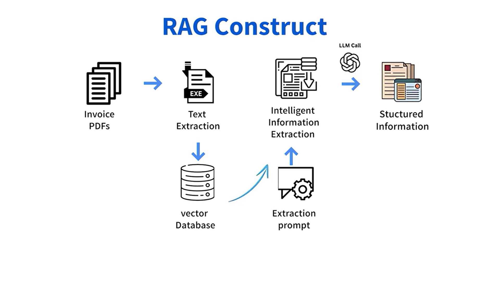

# RAG Invoice Processor: Extração Inteligente de Faturas

Este é um projeto prático e empolgante, desenvolvido como parte do curso **Introduction to RAG** (Coursera), que transforma a teoria em prática, aplicando o conceito de **Geração Aumentada por Recuperação (RAG - Retrieval Augmented Generation)** em uma aplicação do mundo real: a **extração de dados de faturas**.

---

## 🎯 Visão Geral do Projeto

O objetivo principal deste projeto é demonstrar a eficácia do **RAG** no processamento de documentos estruturados. Especificamente, desenvolvi um sistema que pode receber um documento de **fatura em formato PDF**, extrair as informações-chave de forma precisa e retornar esses dados em um **formato estruturado**.

### 💡 Meu Objetivo Profissional

Minha motivação com este projeto e curso foi **aprofundar meu conhecimento** na aplicação de RAG e aprimorar o uso de **LLMs em *chatbots***, incluindo o desenvolvimento de agentes, o uso de *tools* (ferramentas) e a manipulação de *embeddings*.

Este projeto proporcionou experiência prática completa na construção de aplicações RAG, cobrindo desde a **preparação dos dados** e a **configuração do modelo** até o **desenvolvimento da interface**.

---

## ✨ Recursos e Tecnologias em Destaque

O projeto é uma prova de conceito de como o RAG aprimora a análise tradicional de documentos, combinando a capacidade de **reconhecimento de padrões** de *machine learning* com a **compreensão contextual** dos *Large Language Models* (LLMs). É uma abordagem poderosa para lidar com variações em formatos de faturas e extrair informações com **alta precisão**.

* **RAG:** *Retrieval Augmented Generation* para extração de dados contextuais.
* **LLMs:** Utilização de modelos de linguagem para processamento e estruturação de texto.
* **Extração de Dados:** Foco em extrair informações-chave da fatura (ex: fornecedor, valor total, data de vencimento).
* **Interface:** *User-friendly* desenvolvida com **Streamlit** para acessibilidade e facilidade de uso.

---

## 🛠️ Arquitetura e Fluxo de Trabalho do RAG

A solução segue um *pipeline* RAG bem definido para garantir a extração de dados eficiente:

1.  **Ingestão de Documentos:** O PDF da fatura é carregado usando *document loaders*.
2.  **Preparação de Dados:** O documento é dividido em **pedaços (*chunks*)** menores e gerenciáveis.
3.  **Vetorização e Armazenamento:**
    * **Embeddings:** *Embeddings* vetoriais são criados para cada pedaço de texto.
    * **Vector Database:** Os *embeddings* são armazenados em um banco de dados vetorial para uma recuperação rápida.
4.  **Processamento da Fatura:**
    * **Busca de Similaridade:** Quando uma fatura é processada, o sistema usa uma **busca de similaridade** (*similarity search*) para encontrar os pedaços mais relevantes no banco de dados vetorial.
    * **Aumento de Prompt:** Essas informações recuperadas (**o contexto**) são usadas para **aumentar o *prompt*** (instrução) enviado ao LLM.
5.  **Extração Final:** O **Large Language Model** utiliza o contexto aumentado para extrair e estruturar os detalhes-chave da fatura, apresentando-os através da **interface do Streamlit**.



## 🚀 Instalação e Execução

### Pré-requisitos
- Python 3.11+
- pip
- Chave de API do Google Gemini (`GOOGLE_API_KEY` no arquivo `.env`)

### Instalação
```bash
git clone https://github.com/seu-repo/rag-invoice-processor.git
cd rag-invoice-processor
pip install -r requirements.txt
```

### Executar aplicação
```bash
streamlit run streamlit_app.py
 ```
